# Practical-Assignment-Module11
repo containing files for second practical assignment for PCMLAI course
### [link to public github repo containing code](https://github.com/mnazers734/Practical-Assignment-Module11)

## Data Task Definition
Use regression techniques to predict the value of the target variable, price, based independent feature variables such as vehicle year, mileage, etc available in the dataset.This will be accomplished using by applying exploratory data analysis, feature engineering, and model selection to the provided dataset to identify important features which are predictors of sale price. The assumption is that this data analysis is for a 'standard' used car dealership that does not deal with exoctic or extremely vintage vehicles. 

## Data Understanding
After loading the vehicle.csv dataset, the first step in analyzing the data was to identify and remove duplicate records. Initial inspection of the dataset showed there were 56202 duplicated records out of a total of 426808 records. These records were removed and the remaining records were analyzed further. 

### Unique values and descriptive statistical information for features.
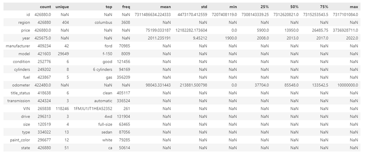

One thing that immediately stood out from the table was the number of unique VINs contained in the dataset. There were only 118246 VINs but 426880 records. VINs are unique and should not appear more than one time - except if the same vehicle was sold multiple times. Getting the unique values for the VIN showed some VINs were repeated over two hundred times. 

VIN 
1FMJU1JT1HEA52352    261 
3C6JR6DT3KG560649    235 
1FTER1EH1LLA36301    231 
5TFTX4CN3EX042751    227 
1GCHTCE37G1186784    214 
                    ... 
KL4CJ1SB3KB823215      1 
1FADP5AU8HL103646      1 
1FMEU7DE1AUA64532      1 
1G1ZD5ST6KF128820      1 
SAJGX2749VCOO8376      1 

To account for the case where the same vehicle was sold multiple times, all records where the combination of VIN, price and odometer were duplicated. This resulted in only about 120000 records remaining out of the initial 426000. 

### Removing un-needed features
After analyzing the vehicles dataset, it was decided to remove the **VIN, model and id** features because they would not provide value in predicting car prices
The **title** feature was also removed after records with the **title** value of **salvage** were removed. Used car dealerships generally do not sell salvaged cars. 

### Removing outliers
Analyzing the data showed outliers were present for the **year**, **price** and **odometer** features. To account for this, records for vehicles manufactured before 1980, vehicles with price less than $5000 and more than $150000, and vehicles with zero miles or greater than 500000 were removed. 

### Analyzing missing values per feature
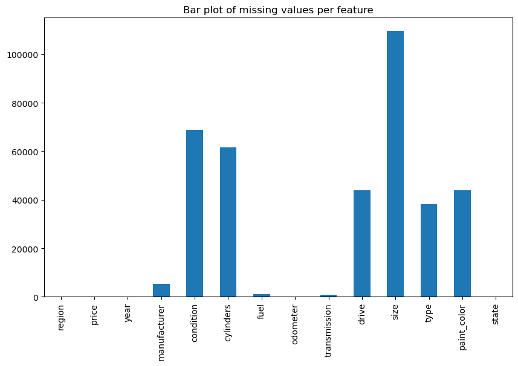 
The **size** feature was removed due to 70% of the results being missing. It will be decided during exploratory data analysis if the other features with high percentage of missing values should be kept. 

## Data Analysis

### Price distribution
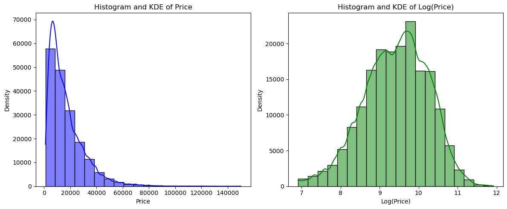 
The distribution of the target price feature appears to be logarithmetic and the plot of log(price) has more of a normal distribution. Therefore, the log of the price will be used when the models are trained. 

### Categorical Feature Analysis
The link below shows correlation values for all categorical features with price
[Correlation values for categorical features](./data/categorical_correlations.xlsx)

region:         #unique 404 missing 0% 
manufacturer:   #unique 43  missing 3% 
condition:      #unique 7   missing 40% 
cylinders:      #unique 9   missing 36% 
fuel:           #unique 6   missing 1% 
transmission:   #unique 4   missing 0% 
drive:          #unique 4   missing 26% 
type:           #unique 14  missing 22% 
paint_color:    #unique 13  missing 26% 
state:          #unique 51  missing 0% 

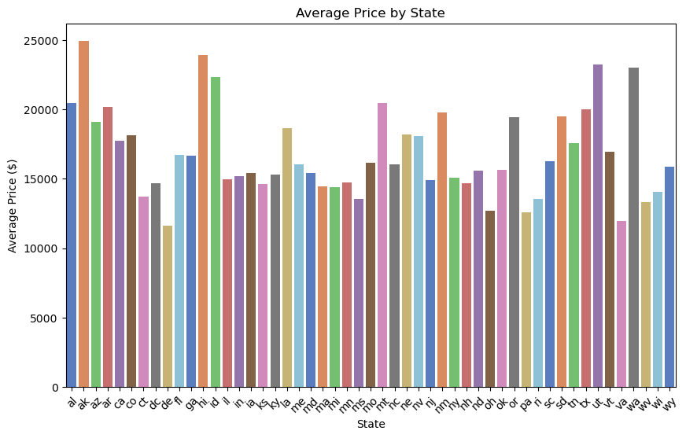 
### State feature
The bar chart above of average vehicle sale price per state shows a wide distribution of sale price per state. However, the correlation values per state vs price were very low. Because of this and the high dimensionality of the state feature, this feature was dropped from the training set. This feature should be explored further in future iterations. 

### Cylinders and condition features
The cylinders and condition features are ordinal categorical features so they were converted to numerical features. Both features have a large number of missing values but they are considered important features so missing features were filled with the average value for all other features. 

### Scatter plots of Numerical Features
Several scatter plots were produced to examine the relation ship between features and price. Key plots are shown below. Based on these plots, the following relationships were observed: 
    The Odometer feature appears to have a negative logarithmetic relationship to price.
    The Year feature appears to have a positive exponential relationship to price.
    The majority of Transmission values are automatic transmissions so this feature can be dropped from the final data set.
    For the Fuel feature, there appears to be a higher price for diesel engine types.  

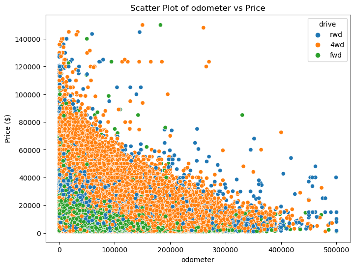 
 

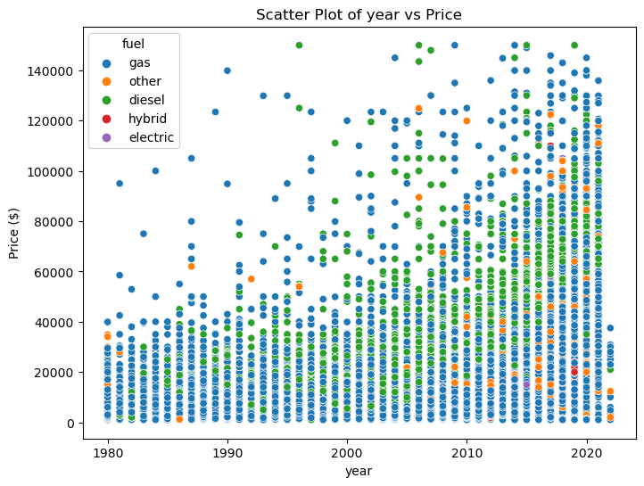 
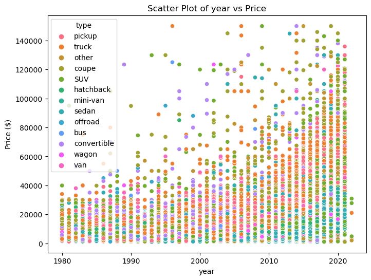 

### Correlation matrix from numerical features - including cylinders and condition
The correlation matrix below shows the following correlations with price:
    There is a positive correlation between Year and price
    There is a negative correlation between Odometer and price
    There is a slight correlation between higher number of cylinders and price
    There is a slight correlation between better condition of the vehicle and price

  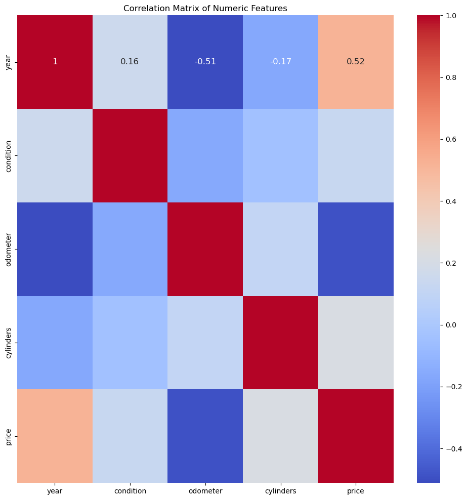

### Final Parameter Selection
The final parameters selected for model training were [odometer, mileage, cylinders, condition, fuel, drive, price]
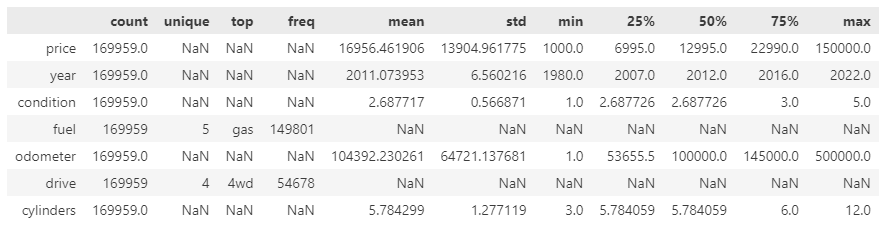 

## Model Training

### Train Test Split
Seventy percent of the data was used for training and the remaining thirty percent was used for testing. The log('price') was used as 'y' values because a logarithmetic relationship was observed during the data analysis phase

For detailed training results, refer to the spreadsheet linked below:
[Model Training Results](./data/model_training_results.xlsx)

### Simple cross validation:
#### Model One
The first model was trained using simple cross-validation with the two numerical features, **odometer** and **year**, which had the highest correlated value with price. The test was performed using a pipeline of PolynomialFeatures and LinearRegression. The degree was varied from 1-10

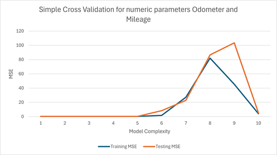 

#### Model Two
The second model was trained using the same features as the first model but this time StandardScaler was used in the pipeline between PolynomialFeatures and LinearRegression

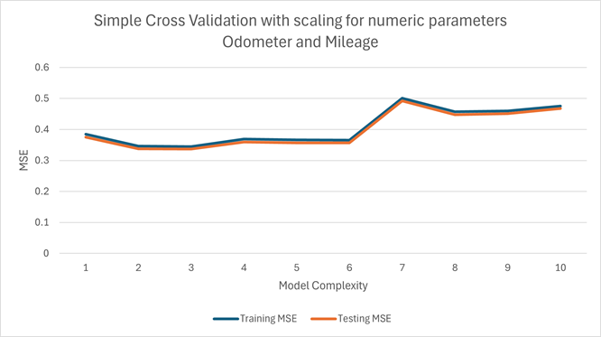 

#### Model Three
A third model was trained using simple cross-validation using all numeric features from the final dataset **odometer**, **year**, **cylinders** and **condition**. The same pipeline was from trail two was used

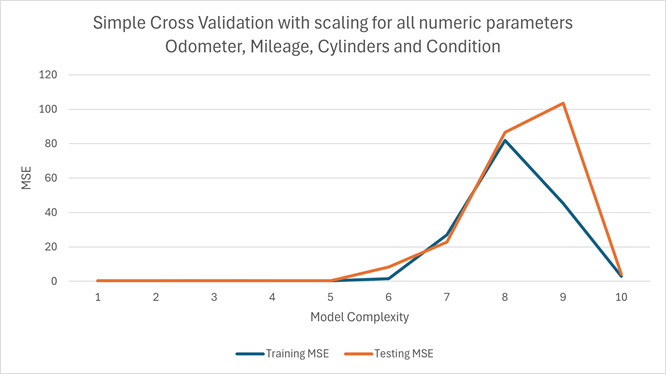 

#### Model Four
Before model four was trained, SequentialFeatureSelection was used to determine the best parameters to use for model fitting. Before running the SequentialFeatureSelection, the categorical features **fuel** and **drive** where converted to numerical features using one shot encoding. It was determined by SequentialFeatureSelection that **odometer**, **year**, **cylinders** and **fuel_gas** where the best parameters for model fitting. 
The same pipeline setup from model three training was used to train model four

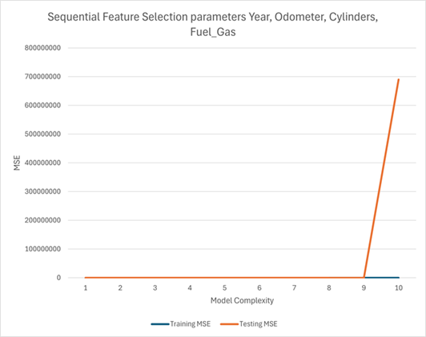 

#### Simple Cross Validation Results
The table below shows the training and test Mean Squared Error and R2 Scores for the four cross validation models. The model that performed the best was model four which used the parameters determined using sequential feature selection. The test MSE was 0.240613496 and the R2 score was 0.646414436. However, this was only marginally better than the other models

<table>
  <caption>Table 1 Comparison of Simple Cross-Validation Models</caption>
  <thead>
    <tr>
      <th>Training Method</th>
      <th>Polynomial Degree</th>
      <th>Train_MSE</th>
      <th>Train_R2_Score</th>
      <th>Test_MSE</th>
      <th>Test_R2_Score</th>
    </tr>
  </thead>
  <tbody>
    <tr>
      <td>Simple-Cross Validation Errors</td>
      <td>3</td>
      <td>0.267302072</td>
      <td>0.612247273</td>
      <td>0.260471905</td>
      <td>0.61723217</td>
    </tr>
    <tr>
      <td>Simple Cross-Validation Odometer & Year</td>
      <td>3</td>
      <td>0.344678295</td>
      <td>0.500004067</td>
      <td>0.336408358</td>
      <td>0.50564228</td>
    </tr>
    <tr>
      <td>Simple-Cross Validation (All Scaled)</td>
      <td>3</td>
      <td>0.267302072</td>
      <td>0.612247273</td>
      <td><b>0.260471905</b></td>
      <td><b>0.61723217</b></td>
    </tr>
    <tr>
      <td>Sequential Feature Selection</td>
      <td>5</td>
      <td>0.243064494</td>
      <td>0.647406697</td>
      <td>0.240613496</td>
      <td>0.646414436</td>
    </tr>
  </tbody>
</table>

### Hyper-parameter tuning using Ridge Regression with GridSearchCV:
The parameters selected via Sequential Feature Selection were used as training and test data for Hyperparameter tuning using GridSearchCV. GridSearchCV was run twice using two different pipelines. The only difference between the two pipelines used was that one used a PolynomialFeatures transformer and one did not. The pipeline with PolynomialFeatures is shown below: 

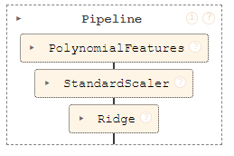 

The results from the hyperparameter tuning are shown in the table below. Overall the Ridge Regression performed slightly worse than Simple Cross Validation. With the best test MSE of 0.24615111472551 and R2 score of 0.638527812829079 for hyperparameters alpha = 0.01 and degree = 5. 

<table>
  <caption><b>Using GridSearchCV to perform Ridge Regression on features determined using Sequential Feature Selection (Odometer, Mileage, Cylinders, and Fuel_Gas)</b></caption>
  <thead>
    <tr>
      <th></th>
      <th>Without Polynomial Features</th>
      <th>With Polynomial Features</th>
    </tr>
  </thead>
  <tbody>
    <tr>
      <td>Train MSE</td>
      <td>0.294280367</td>
      <td>0.249185261</td>
    </tr>
    <tr>
      <td>Test MSE</td>
      <td>0.288950468</td>
      <td>0.246151115</td>
    </tr>
    <tr>
      <td>Train R2</td>
      <td>0.573112121</td>
      <td><b>0.638527813</b></td>
    </tr>
    <tr>
      <td>Test R2</td>
      <td>0.575382445</td>
      <td>0.638276812</td>
    </tr>
    <tr>
      <td>Best Alpha</td>
      <td>10</td>
      <td>0.01</td>
    </tr>
    <tr>
      <td>Polynomial Degree</td>
      <td>NA</td>
      <td>5</td>
    </tr>
  </tbody>
</table>

# Findings and reccomendations
The models trained indicated the following features were most important when determining vehicle price, **odometer, year, cylinders, condition, fuel_gas**. The odometer and fuel_gas features were negatively correlated with price and the remaining parameters had positive correlation. However, models trained with these parameters only had an average ability to predict the price of vehicles in the test dataset. Also, the training and test errors were low for models with lower degree of complexity indicating the selected parameters did not provide enough complexity to accurately model the complexity of the relationship between features and price. The data should be revisted to select additional parameters that will increase the models complexity. 

The source of dataset should also be investigated further to verify that the data is valid. The large number of duplicated records makes the datas validity questionable. 

Initial reccomendation to the customer: Additional investigation is needed to find the best attributes to target when acquiring used cars but relatively newer vehicles with a higher number of cylinders (6-8) in good - excellent condition in the $20K-$25 price range seem to be what consumers are targeting when buying a used car. Also, diesel vehicles have a higher selling price than other fuel types. From the exploratory data analysis, vehicle type of pickup or truck are most sought after. The vehicle type sedan had a slight negative correlation. Also, vehicles with paint_color white appear to have a slightly higher selling price. 
